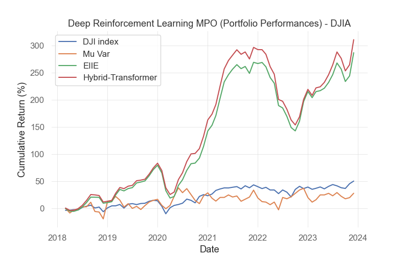
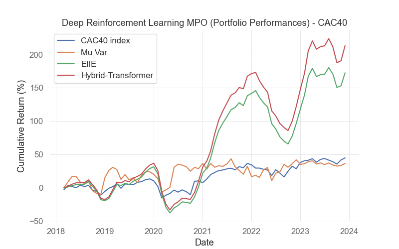
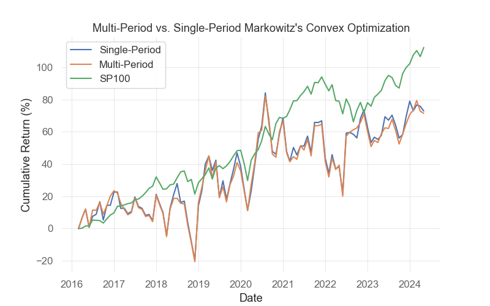

# WorldQuant University Project: Deep Reinforcement Learning in Multi-period portfolio optimization

## Abstract
   
In our paper, we apply Deep Reinforcement Learning approaches to portfolio optimization under multi-period cases and compare the deep reinforcement learning approaches with the classical convex optimization approach. We demonstrated that it is indeed possible to obtain a more realistic portfolio construction that allows for adjustments and optimization across multiple periods, resulting in the portfolio design process capable of adapting to changing market conditions, economic events, and evolving investment opportunities which are better models of how the financial market works, ensuring opportunities are not missed until too late.

## Portfolio Performances

### Multi-Period Portfolio Optimization using Deep RL
Below are a display of the DRL Portfolios against the Index and a classical Markowitz's Mean Variance strategy for two markets, namely the Dow Jones Industrial Average (DJIA) and the French Market Index (CAC40). The following models are used in the comparison:
- Deep Reinforcement Learning Agent with a Multi-Period extension of the Ensemble of Identical Independent Evaluators (EIIE) policy function.
- Deep Reinforcement Learning Agent with a Hybrid-Transformer (using Convolutional Embeddings) policy function.
- Stock Market Index / Benchmark
- Harry Markowitz's Multi-period Mean Variance Optimization.

1. Portfolio Performance on the DJIA



#### Performance Metrics:

|  | DJIA_Index |	MV | DRL_EIIE | DRL_HYBRID_TRANSFORMER |
| :----: | :----: | :--: | :------: | :-------: |
| fAPV |	1.559775 |	1.277676 | 3.885800 | 4.084288 |
| SR |	0.567364 |	0.279325 | 1.141641 | 1.181615 |
| MDD |	-0.216025 |	-0.294017 | -0.342277 | -0.360279 |


2. Portfolio Performances on the (CAC-40)



#### Performance Metrics:

|  | CAC40_Index |	MV | DRL_EIIE | DRL_HYBRID_TRANSFORMER |
| :----: | :----: | :--: | :------: | :-------: |
| fAPV |	1.492397 |	1.365279 | 3.131037 | 2.825879 |
| SR |	0.475353 |	0.325570 | 0.846357 | 0.784852 |
| MDD |	-0.252401 |	-0.282496 | -0.511276 | -0.510508 |


### Multi-Period Optimization vs. Single-Period Optimization
Following below we also demonstrate the difference between a Portfolio of Multi-Period Optimization and of a Single Period Optimization using Harry Markowitz's Mean Variance Convex Optimization using the assets in the S&P100 against the Benchmark itself.



#### Performance Metrics:

|   | MPO | SPO | SP100 |
| :----: | :----: | :--: | :------: | 
| fAPV | 1.714606 |	1.729492 |	2.123633 |
| SR | 0.353029 |	0.358771 |	0.942288 |
| MDD | -0.356124 |	-0.371382 |	-0.143636 |


## Choice of Hyperparameters
The Hyperparameters that were used for the Agent training are saved in the `config.json` file. 
The most important parameters are:
- `Monthly` data frequency.
- Multi-Period `T` prediction steps of 3. We are predicting weights for the next 3 months of trading. 
- Time Window of `N` of 24, which is the last 2 years of data.
- Features of `close`, `high`, `low`, `volume` for each asset.
- Initial trading amount of `10000`.
- Commission Fee of `0.25`basis points and the Transaction Factor Remainder `TRF` Model.
- Learning Rate of `0.0001`.
- Number of episodes of `35`.
- Batch size of `64`.

## Prerequisites

[Poetry](https://python-poetry.org/docs/) a tool for dependency management and packaging in Python.

### Install Poetry

* Linux, macOS, Windows (WSL)

```
curl -sSL https://install.python-poetry.org | python3 -
```

* Windows (Powershell)

```
(Invoke-WebRequest -Uri https://install.python-poetry.org -UseBasicParsing).Content | py -
```

## Run the project

### Install required libraries

```
$ poetry install
$ poetry run poe autoinstall-torch
```

### Run the project with Poetry

```
$ poetry run jupyter notebook
```

### Export libraries with Poetry

```
$ poetry run pip3 freeze > requirements.txt
```

## Acknowledgements
Special thanks to WorldQuant University for assisting us in the creation of this project towards an MSc in Financial Engineering.